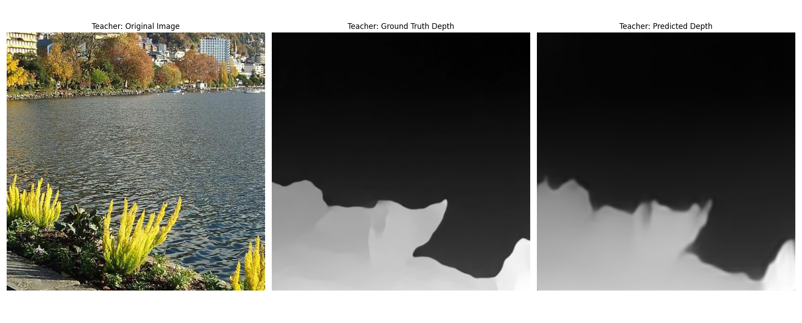
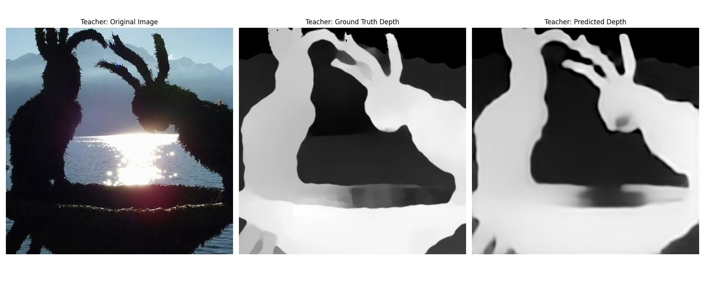

# Depth Anything

1. Complete Depth Anything Code including **Data Preprocessing, Loss Functions, and Training Process with metrics**

2. Basic Teacher & Student Result 

---

Original paper & code

- [Depth Anything](https://github.com/LiheYoung/Depth-Anything)

---

The considerations during project

- [Notion link](https://even-bay-44c.notion.site/Depth-Anything-construction-1ceee63422d0801fa141d3341ecd1c6d)


## 1. Complete Depth Anything Code 

```bash
.
├── configs
│   └── config.yaml  # hyperparams
├── src
│   ├── data
│   │   ├── __init__.py
│   │   ├── data_loader_student.py  
│   │   ├── data_loader_teacher.py
│   │   └── load_data.py  # Functions and classes for custom dataloader. ( cutmix, batch ratio ... )
│   ├── loss
│   │   ├── __init__.py
│   │   ├── loss_student.py  # L_l loss 
│   │   └── loss_teacher.py  # L_l + L_u + L_feat loss
│   ├── models
│   │   ├── __init__.py
│   │   └── model.py  # Pass additional output from final encoder layer for L_feat loss on original code 
│   ├── utils
│   │   ├── __init__.py
│   │   ├── check_device.py
│   │   └── metrics.py  # Scale - shift restoration (least square) and RelAbs, δ metrics
│   ├── evaluate.py
│   ├── predict.py
│   └── train.py
├── wandb  # logs & tracking with API
├── README.md
└── requirements.txt
```

To install the required packages, run:

```bash
pip install -r requirements.txt
```


To train the model, run:

```bash
python -m src.train (--teacher or --student)
```

To resume training the model, run:

```bash
python -m src.train (--teacher or --student) --resume --run_id {actuall wandb id}
// run_id is from 'wandb runs' that you want to resume. 
```

To predict the model, run:

```bash
python -m src.predict (--teacher or --student)
```

---
## 2. Basic Teacher & Student Result 

### < Teacher >

Avg Validation Loss: 0.2292

Avg AbsRel: 0.0692

Avg Delta1: 0.9458

-> Avg of 3 trials



---
